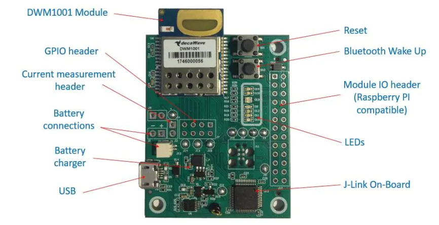
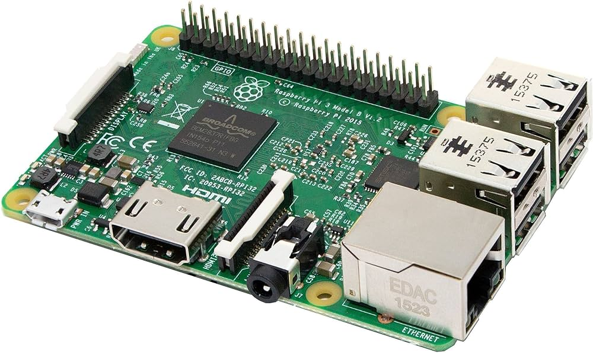
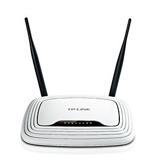
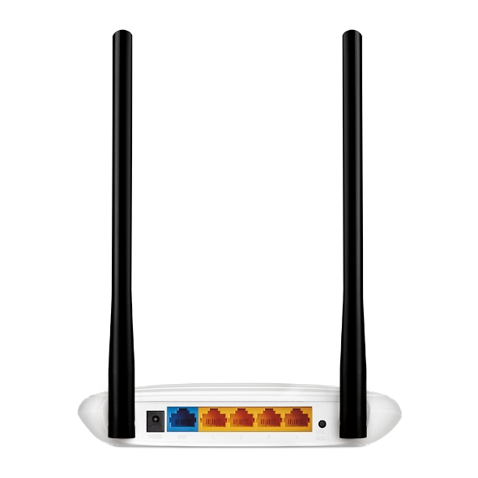
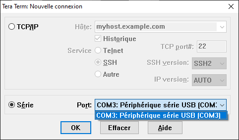
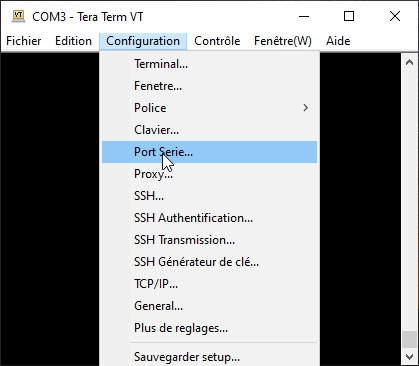
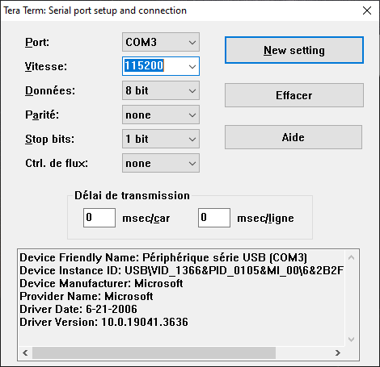
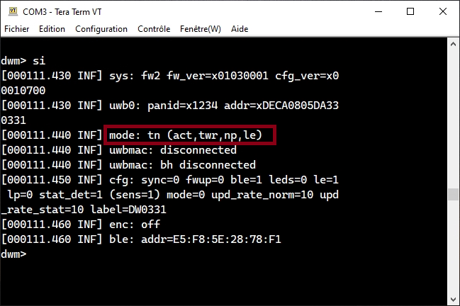

Installation du matériel
========================

Présentation du matériel
-------------------------

Le matériel est constitué de :

- Plusieurs capteurs de localisation **Decawave DWM1001-Dev**

- Un **Raspberry Pi** connecté avec un capteur **DWM1001-Dev** par le biais d'un **header 2x13 long pins**

.. image:: images/dwm1001-bridge.jpeg
  :width: 300

- Un deuxième **Raspberry Pi**

- Un routeur **TP-Link**

Procédure d'Installation
--------------------------

Connectez l'alimentation des deux Raspberry Pi, ainsi que celle du routeur.

Avec deux câbles Ethernet, connectez les deux Raspberry à l'arrière du routeur sur les ports RJ45 de couleur orange comme indiqué ci dessous :

Installation de capteurs DWM1001-Dev déjà configurés
-----------------------------------------------------

Cette étape doit s'appliquer à des capteurs déjà configurés. Pour des capteurs non configurés ou pour tout problème de dysfonctionnement, veuillez vous référer à l'étape suivante : :ref:`Configuration de capteurs DWM1001-Dev non configurés <capteurs_non_config>`

Dans un premier temps, il est nécessaire d'identifier quels sont les capteurs mobiles et les capteurs fixes. 
Un capteur fixe est un capteur qui sera positionné dans une pièce de votre habitation, tandis qu'un capteur mobile est un capteur effectuant le déplacement avec une personne. 

Installez Tera Term (Pour Windows) : https://osdn.net/projects/ttssh2/releases/

Pour Linux ou MacOS, vous pouvez utiliser d'autres utilitaires tels que SerialTool ou Minicom par exemple.

Sur Tera Term, sélectionnez le port portant le nom **Périphérique série USB** (l'identificateur de port n'est pas nécessairement **COM3**)

Ensuite, dans la console de Tera Term, veuillez sélectionner Configuration -> Port Serie...

Puis veuillez sélectionner la vitesse de transmission à **115200** bauds et cliquez sur **New setting**.

Dans la console, appuyez deux fois sur la touche **Entrée** pour démarrer le mode shell du capteur, puis entrez la commande **si**
Vous devriez alors voir des informations s'afficher. Cherchez la ligne **mode** comme indiqué ci-dessous et prenez connaissance de ce qui est affiché.

Il existe trois modes possibles :

- **mode: tn (act,twr,np,le)** : Ce mode indique que le capteur est mobile

- **mode: ani (act,real)** : Ce mode indique que le capteur est fixe

- **mode: an (act,-)** : Ce mode indique que le capteur est fixe

Voilà, vous connaissez maintenant l'identité de vos capteurs !

Parmi l'ensemble des capteurs que vous possédez, vous devriez voir apparaître au moins une fois chacun des trois modes de configuration. Dans le cas contraire, je vous invite à configurer vos capteurs à l'étape suivante : :ref:`Configuration de capteurs DWM1001-Dev non configurés <capteurs_non_config>`

Configuration de capteurs DWM1001-Dev non configurés
------------------------------------------------------

.. _capteurs_non_config:

Si vous souhaitez ajouter de nouveaux capteurs de localisation DWM1001-Dev, il sera nécessaire de les configurer.

Pour permettre au processus de localisation de fonctionner, les capteurs doivent être configurés avec les modes suivants :

- Anchor initiator : **mode: ani (act,real)**. Ce mode permet de configurer un capteur fixe qui va initier le réseau de capteur. Il est impératif d'avoir au moins un capteur configuré sur ce mode.
\

- Anchor : **mode: an (act,-)**. Ce mode permet de configurer un capteur fixe classique. Vous pouvez configurer autant de capteurs que nécessaire sur ce mode (en général, vous pouvez utiliser un capteur fixe par pièce de votre habitation en incluant également le capteur fixe initiateur)
\

- Tag : **mode: tn (act,twr,np,le)**. Ce mode permet de configurer un capteur mobile. Vous devrez configurer un capteur mobile pour chaque utilisateur dans votre habitation.

.. toctree::
   environnement_dev/environment_dev