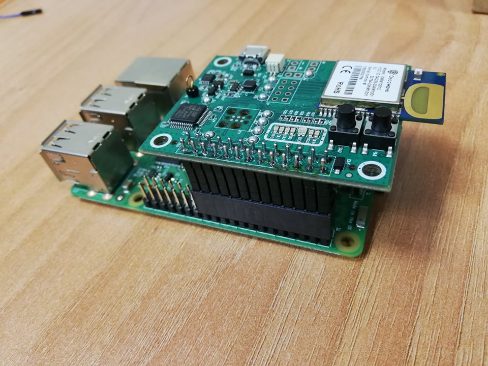
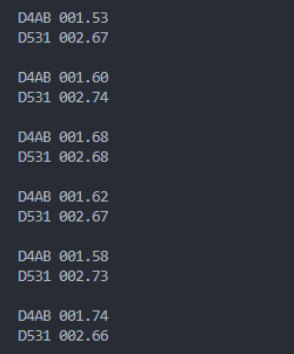

Installation du matériel
========================

.. _installation_materiel:

Présentation du matériel
-------------------------

Le matériel est constitué de :

- Plusieurs capteurs de localisation **Decawave DWM1001-Dev**

.. image:: images/dwm1001-dev.png
  :width: 400

- Un **Raspberry Pi** connecté avec un capteur **DWM1001-Dev** par le biais d'un **header 2x13 long pins**

- Un deuxième **Raspberry Pi**

- Un routeur **TP-Link**

Procédure d'Installation
--------------------------

Connectez l'alimentation des deux Raspberry Pi, ainsi que celle du routeur.

Avec deux câbles Ethernet, connectez les deux Raspberry à l'arrière du routeur sur les ports RJ45 de couleur orange comme indiqué ci dessous :

Installation de capteurs DWM1001-Dev déjà configurés
-----------------------------------------------------

Cette étape doit s'appliquer à des capteurs déjà configurés. Pour des capteurs non configurés ou pour tout problème de dysfonctionnement, veuillez vous référer à l'étape suivante : :ref:`Configuration de capteurs DWM1001-Dev non configurés <capteurs_non_config>`

Dans un premier temps, il est nécessaire d'identifier quels sont les capteurs mobiles et les capteurs fixes. 
Un capteur fixe est un capteur qui sera positionné dans une pièce de votre habitation, tandis qu'un capteur mobile est un capteur effectuant le déplacement avec une personne. 

Installez Tera Term (Pour Windows) : https://osdn.net/projects/ttssh2/releases/

Pour Linux ou MacOS, vous pouvez utiliser d'autres utilitaires tels que SerialTool ou Minicom par exemple.

Vous devez maintenant réitérer les étapes ci-dessous pour chaque capteur que vous possédez :

- Branchez le capteur à votre PC à l'aide d'un câble USB

\

- Sur Tera Term, sélectionnez le port portant le nom **Périphérique série USB** (l'identificateur de port n'est pas nécessairement **COM3**)

.. image:: images/teraterm.png
  :width: 400

- Ensuite, dans la console de Tera Term, veuillez sélectionner Configuration -> Port Serie...

.. image:: images/teraterm_console.png
  :width: 400

- Puis veuillez sélectionner la vitesse de transmission à **115200** bauds et cliquez sur **New setting**.

.. image:: images/teraterm_config.png
  :width: 400

- Dans la console, appuyez deux fois sur la touche **Entrée** pour démarrer le mode shell du capteur, puis entrez la commande **si**

\
Vous devriez alors voir des informations s'afficher. Cherchez la ligne **mode** comme indiqué ci-dessous et prenez connaissance de ce qui est affiché.

.. image:: images/teraterm_tag.png
  :width: 400

- Il existe trois modes possibles :

  - **mode: tn (act,twr,np,le)** : Ce mode indique que le capteur est mobile

  - **mode: ani (act,real)** : Ce mode indique que le capteur est fixe

  - **mode: an (act,-)** : Ce mode indique que le capteur est fixe

Voilà, vous connaissez maintenant l'identité de vos capteurs !

Parmi l'ensemble des capteurs que vous possédez, vous devriez voir apparaître au moins une fois chacun des trois modes de configuration. Dans le cas contraire, je vous invite à reconfigurer vos capteurs à l'étape suivante : :ref:`Configuration de capteurs DWM1001-Dev non configurés <capteurs_non_config>`

Dans un deuxième temps, vous pouvez brancher tous les capteurs fixes que vous avez identifié dans chaque pièce de votre habitation et équiper tous vos utilisateurs en branchant un capteur mobile à leur équipement.

Vous avez donc fini l'étape de configuration des capteurs, sauf si vous avez à votre disposition de nouveaux capteurs non configurés à l'état d'usine.

Pour configurer d'autres capteurs, passez à la section suivante, sinon, passez à la section :ref:`Vérification du bon fonctionnement des capteurs <verif_capteurs>`

.. _capteurs_non_config:

Configuration de capteurs DWM1001-Dev non configurés
------------------------------------------------------

Si vous souhaitez ajouter de nouveaux capteurs de localisation DWM1001-Dev, il sera nécessaire de les configurer.

Pour chaque capteur non configuré que vous possédez, vous devrez répéter toutes les étapes ci-dessous.

Pour commencer, veuillez installer le logiciel J-Link : https://www.segger.com/downloads/jlink/

Lors de l'installation du logiciel, appuyez toujours sur **Next**, puis à la fin, appuyez sur **Ok** et **Finish**

Notre objectif ici est de flasher le capteur avec un firmware donné. Pour cela, cherchez le programme **J-Flash Lite** et lancez le.

Le menu suivant apparaît alors. Dans **Device**, cherchez et sélectionnez le modèle **NRF52832_XXAA**, puis cliquez sur **OK**

.. image:: images/jflash-lite_menu.png
  :width: 500

Sélectionnez une fréquence de **1000 kHz**, et cliquez sur **OK**

Ici, sélectionnez le firmware **DWM1001_PANS_R2.0.hex**

Puis cliquez sur **Program Device**

Installez Tera Term (Pour Windows) : https://osdn.net/projects/ttssh2/releases/

Pour Linux ou MacOS, vous pouvez utiliser d'autres utilitaires tels que SerialTool ou Minicom par exemple.

Branchez le capteur à votre PC à l'aide d'un câble USB

Sur Tera Term, sélectionnez le port portant le nom **Périphérique série USB** (l'identificateur de port n'est pas nécessairement **COM3**)

.. image:: images/teraterm.png
  :width: 400

Ensuite, dans la console de Tera Term, veuillez sélectionner Configuration -> Port Serie...

.. image:: images/teraterm_console.png
  :width: 400

Puis veuillez sélectionner la vitesse de transmission à **115200** bauds et cliquez sur **New setting**.

.. image:: images/teraterm_config.png
  :width: 400

Dans la console, appuyez deux fois sur la touche **Entrée** pour démarrer le mode shell du capteur

Pour permettre au processus de localisation de fonctionner, les capteurs doivent être configurés avec les modes suivants :

- Anchor initiator : **mode: ani (act,real)**. Ce mode permet de configurer un capteur fixe qui va initier le réseau de capteur. Il est impératif d'avoir au moins un capteur configuré sur ce mode.

\

- Anchor : **mode: an (act,-)**. Ce mode permet de configurer un capteur fixe classique. Vous pouvez configurer autant de capteurs que nécessaire sur ce mode (en général, vous pouvez utiliser un capteur fixe par pièce de votre habitation en incluant également le capteur fixe initiateur)

\

- Tag : **mode: tn (act,twr,np,le)**. Ce mode permet de configurer un capteur mobile. Vous devrez configurer un capteur mobile pour chaque utilisateur dans votre habitation.

Pour chaque capteur que vous souhaitez configurer, une fois celui-ci configuré, veuillez le débrancher avant de brancher le capteur suivant à configurer.

Pour configurer un anchor initiator, veuillez taper les commandes suivantes :

- (Choisir un ID pour le réseau, par exemple '1234') : **nis 0x1234**

- (Configurer la position du capteur, valeurs fournies par le constructeur) : **aps 0 0 1800**

- (Mettre le capteur en mode initiateur) : **nmi**

Pour configurer un anchor, veuillez taper les commandes suivantes :

- (Taper le même ID de réseau que précédemment) : **nis 0x1234**

- (Configurer la position du capteur, valeurs fournies par le constructeur) : **aps 10000 10000 1800**

- (Mettre le capteur en mode anchor) : **nma**

Pour configurer un tag, veuillez taper les commandes suivantes :

- (Taper le même ID de réseau que précédemment) : **nis 0x1234**

- (Mettre le capteur en mode tag) : **nmt**

A partir de maintenant, laissez votre Tag branché à votre ordinateur, car nous allons devoir y injecter le code permettant de communiquer les distances entres les capteurs.

.. _Source_Code_DWM-Tag.zip: https://github.com/user-attachments/files/16817915/Source_Code_DWM-Tag.zip

Veuillez télécharger le code source du capteur mobile : `Source_Code_DWM-Tag.zip`_

Ensuite, vous aurez besoin du logiciel **Segger Embedded Studio for ARM** : https://www.segger.com/downloads/embedded-studio/#ESforARM 

Et également du compilateur **GNU Tools ARM Embedded (version 5.4 2016q3)**

.. _Windows: https://developer.arm.com/-/media/Files/downloads/gnu-rm/5_4-2016q3/gcc-arm-none-eabi-5_4-2016q3-20160926-win32.exe?rev=b4aea310407243888567fc9cd4aded8b&revision=b4aea310-4072-4388-8567-fc9cd4aded8b?product=Downloads,32-bit,,Windows,5-2016-q3-update

.. _Linux: https://developer.arm.com/-/media/Files/downloads/gnu-rm/5_4-2016q3/gcc-arm-none-eabi-5_4-2016q3-20160926-linux.tar.bz2?rev=111dee36f88b46728ac648cf41b4d375&revision=111dee36-f88b-4672-8ac6-48cf41b4d375?product=Downloads,32-bit,,Linux,5-2016-q3-update

.. _MacOS: https://developer.arm.com/-/media/Files/downloads/gnu-rm/5_4-2016q3/gcc-arm-none-eabi-5_4-2016q3-20160926-mac.tar.bz2?rev=06ff216cf9464b4abea122a5e09502ca&revision=06ff216c-f946-4b4a-bea1-22a5e09502ca?product=Downloads,64-bit,,Mac%20OS%20X,5-2016-q3-update

Liens de téléchargement : 

- `Windows`_

\

- `Linux`_

\

- `MacOS`_

Une fois **GNU Tools ARM Embedded** et **Segger Embedded Studio for ARM** installés, veuillez extraire l'archive **Source_Code_DWM-Tag.zip** précédemment téléchargée, en effectuant sur ce fichier **Clic droit -> Extraire Tout**

Ensuite, naviguez dans les dossiers **Source_Code_DWM-Tag -> Source_Code_DWM-Tag -> src -> dwm-tag** puis sur le fichier **dwm-tag.emProject**, effectuez **Clic droit -> Ouvrir avec -> Segger Embedded Studio for ARM** 

Une fois le logiciel ouvert, appuyez sur **Target -> Connect J-Link** pour vous connecter au capteur mobile

Puis appuyez sur **Build -> Build dwm-tag** pour compiler le code source

Et enfin, appuyez sur **Target -> Download dwm-tag** pour injecter le code compilé au capteur mobile

.. image:: images/segger_download.png
  :width: 600

Félicitations, vous avez enfin terminé de configurer vos capteurs !

Pour vérifier si tout fonctionne correctement, passez à la section suivante

.. _verif_capteurs:

Vérification du bon fonctionnement des capteurs
-------------------------------------------------

Pour vérifier si les distances fonctionnent, laissez branché ou rebranchez votre **capteur mobile** en USB à votre ordinateur, puis allumez à nouveau **Teraterm**

Rappel de la configuration de Teraterm :

Sur Tera Term, sélectionnez le port portant le nom **Périphérique série USB** (l'identificateur de port n'est pas nécessairement **COM3**)

.. image:: images/teraterm.png
  :width: 400

Ensuite, dans la console de Tera Term, veuillez sélectionner Configuration -> Port Serie...

.. image:: images/teraterm_console.png
  :width: 400

Puis veuillez sélectionner la vitesse de transmission à **115200** bauds et cliquez sur **New setting**.

.. image:: images/teraterm_config.png
  :width: 400

Finalement, si tout fonctionne bien vous devriez voir des informations sur les distances transmises par le capteur mobile, un peu comme ceci :

.. toctree::